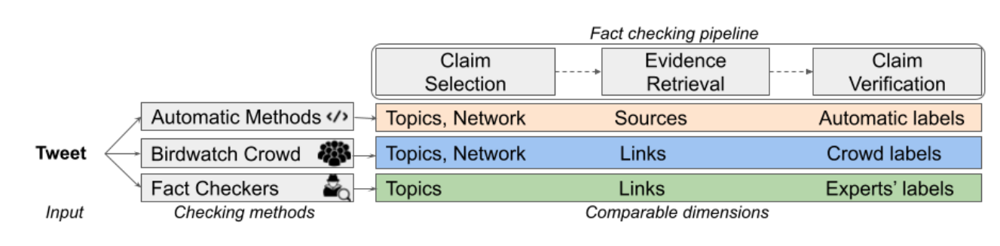

# Crowdsourced Fact-Checking at Twitter: How Does the Crowd Compare With Experts?
[(Paper)](https://arxiv.org/abs/2208.09214)



[BirdWatch](https://blog.twitter.com/en_us/topics/product/2021/introducing-birdwatch-a-community-based-approach-to-misinformation) is a crowdsourcing-based approach for veryfying misleading claims on Twitter. We analyze the initiative through the lens of the three main components of a factchecking pipeline: claim detection based on check-worthiness, evidence retrieval, and claim verification, while comparing with expert fact-checkers and computational methods. This repo contains the required code for running the experiments of the associated paper.


## Installation

### 0. Clone repo
```bash
git clone https://github.com/MhmdSaiid/BirdWatch
cd BirdWatch
```

### 1. Install virtual environment
```bash
virtualenv birdwatch -p $(which python3)
source birdwatch/bin/activate
```

### 2. Install required repositories
```bash
pip install -r requirements.txt
```

### 3. Add virtualenv to jupyter kernel
```bash
pip install --user ipykernel
python -m ipykernel install --user --name=birdwatch
```

### 4. Download ClaimReview Data
```bash
wget -O data/UpdatedClaimReview.zip https://nextcloud.eurecom.fr/s/8fJkTEQH9QeaaxQ/download/UpdatedClaimReview.zip
unzip  data/UpdatedClaimReview.zip -d data/
rm -rf data/UpdatedClaimReview.zip
```
### 5. Download BerTopic Model (Optional)
```
wget -O BW_BertTopic.zip https://nextcloud.eurecom.fr/s/kqXfGg49iTEnJKR/download/BW_BertTopic.zip
unzip  BW_BertTopic.zip -d model/
rm -rf BW_BertTopic.zip
```


## DataSet

The dataset [BW_CR.csv](data/BW_CR.csv) contains the matched Birdwatch tweets with the ClaimReview fact-checks.
BirdWatch dataset was obtained on 18th September 2021 05:02 PM (GMT+2) and the tweets were hydrated on 25th September  2021 09:26 AM (GMT+2).
The columns of the dataset are:

* __tweetId__: ID of the Tweet
* __Tweet__: Tweet text
* __noteId__: ID of BirdWatch note
* __summary__: Written note by the BirdWatch user
* __classification__: Label given by the BirdWatch user
* __CR Fact__: Macthed ClaimReview fact-check
* __credibility__: Label given by the expert
* __full_text__: Full Tweet text containing characters (such as non-unicode) that were removed in the column __Tweet__


## Notebooks


### Analysis 

* [Analyzing BirdWatch Data](notebooks/BirdWatch_Analysis.ipynb) (Section 3.1)
* [Analyzing BirdWatch Users](notebooks/BirdWatch_User_Analysis.ipynb) (Section 3.1)
* [Topic Modeling](notebooks/Topic_Modeling.ipynb) (Section 3.4)


### Matching
* [BW_CR_Text_Sim.ipynb](notebooks/BW_CR_Text_Sim.ipynb) (Section 3.3)


### Claim Selection
* [BW_CR_Topic.ipynb](notebooks/BW_CR_Topic.ipynb) (Section 4.1.1)
* [ClaimBuster_Check-worthy.ipynb](notebooks/ClaimBuster_Check-worthy.ipynb) (Section 4.1.2)
* [Tweet Popularity.ipynb](notebooks/Tweet_Popularity.ipynb) (Section 4.1.3)
* [Time Analysis.ipynb](notebooks/Time_Analysis.ipynb) (Section 4.1.4)


### Evidence Retreival
* [NewsGuard.ipynb](notebooks/NewsGuard.ipynb) (Section 4.2)

### Claim Verifiication
* [Conflict Measure Graph.ipynb](notebooks/Conflict_Measure_Graph.ipynb) (Section 4.3.1)
* [Credibility Matching Analysis.ipynb](notebooks/Credibility_Matching_Analysis.ipynb) (Section 4.3.2)
* [BW Help Code.ipynb](notebooks/BW_Help_Code.ipynb) (Section 4.3.3)
* [Computational Methods.ipynb](notebooks/Computational_Methods.ipynb) (Section 4.3.4)


## Contact Us
For any inquiries, feel free to [contact us](mailto:saeedm@eurecom.fr), or raise an issue on Github.


## Reference
You can cite our work:

```
@inproceedings{saeed-etal-2022-birdwatch,
    title = "Crowdsourced Fact-Checking at Twitter: How Does the Crowd Compare With Experts?",
    author = "Saeed, Mohammed  and
      Traub, Nicolas  and
      Nicola, Maelle  and
      Demartini, Gianluca  and
      Papotti, Paolo",
    booktitle = "31st ACM International Conference on Information and Knowledge Management",
    month = oct,
    year = "2022",
    address = "Online and Atlanta, Georgia, USA",
    url = "https://arxiv.org/abs/2208.09214",
}
```

## License
[MIT](https://choosealicense.com/licenses/mit/)